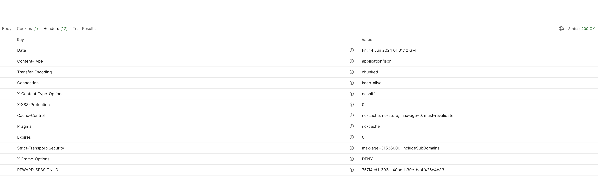

## 배경

리워드 프로젝트에서는 Spring Session + Redis 기반으로 세션을 관리하고 Session Id 는 쿠키로 전달하는 방식으로 세션 사용을 구현하고 있었다. 그러던중 프론트 개발자분이 몇가지 이슈사항이 생겨 쿠키를 헤더방식으로 변경해야 될 것 같다고 말씀을 주셨다. 말씀주신 이슈사항은 아래와 같다.

- **리로드 이슈**
    - 서버에서 Set-Cookie 헤더를 통해 쿠키를 설정하면, 이 쿠키가 브라우저의 다음 요청에 반영되지 않고 페이지 새로 고침을 해야 반영이 되는 간헐적 이슈 발생
- **쿠키 수정의 어려움**
    - Set-Cookie는 브라우저가 자동으로 쿠키를 응답받고 저장하는 과정을 거치기 때문에 개발자가 수정하거나 추가할 수 없다. document.cookie 를 사용하면 가능은 하지만 제약 사항이 많아 사용을 지양한다고 한다.

정리를 해보자면 쿠키를 응답 받은 후 다음 요청에 바로 반영이 안되고 리로드를 해야 반영이 되는 이슈가 있어서 이를 해결하기 위해 수정이 불가한 쿠키가 아니는 헤더로 Session Id 를 응답받아 스크립트를 사용해서 직접 추가를 하기 위해 헤더로 Session Id 전달을 부탁하신 것이다.

## 해결

Spring Session에서 제공하는 HeaderHttpSessionIdResolver 를 커스텀하여 헤더로 SessionId 를 전달하기로 하였다. 찾아보니 HeaderHttpSessionIdResolver 이외에도 다른 여러 Resolver 를 제공하여 다양한 방식으로 SessionId 를 전달할 수 있도록 하는 것 같아 간단히 정리를 해보았다.

### CookieHttpSessionIdResolver(Default)

- 세션 ID를 쿠키를 통해 관리
- 브라우저 기반 애플리케이션에 적합
- 기본값이기 때문에 별도로 빈 등록할 필요 없음

### HeaderHttpSessionIdResolver

- 세션 ID를 HTTP 헤더를 통해 관리
- 기본적으로 `X-Auth-Token` 헤더를 사용
- RESTful API, 모바일 앱, 서드파티 클라이언트와의 통신에 적합
- 빈으로 등록하여 사용

### CustomHttpSessionIdResolver

- `HttpSessionIdResolver` 인터페이스를 직접 구현하여 사용자 정의 세션 ID 리졸버를 통해 관리
- 복잡한 요구 사항을 처리해야 하는 경우 유용
- 빈으로 등록하여 사용

### HeaderHttpSessionIdResolver  사용

- 나는 HeaderHttpSessionIdResolver 를 커스텀하여 기존에 사용하던 쿠키이름의 헤더를 통해 sessionId 를 전달하도록 코드를 수정하였다.

```jsx
@Configuration
public class HttpSessionIdResolverConfig {

    @Bean
    public HttpSessionIdResolver httpSessionIdResolver() {
        return new CustomSessionIdResolver(SESSION_ID_COOKIE_HEADER);
    }
}
```

```jsx
public class CustomSessionIdResolver extends HeaderHttpSessionIdResolver {

    public static final String SESSION_ID_COOKIE_HEADER = "REWARD-SESSION-ID";

    public CustomSessionIdResolver(String headerName) {
        super(headerName);
    }

    @Override
    public List<String> resolveSessionIds(HttpServletRequest request) {
        List<String> sessionIds = super.resolveSessionIds(request);
        if (sessionIds.isEmpty()) {
            String sessionId = request.getHeader(SESSION_ID_COOKIE_HEADER);
            if (StringUtils.hasText(sessionId)) {
                sessionIds.add(sessionId);
            }
        }
        return sessionIds;
    }

    @Override
    public void setSessionId(HttpServletRequest request, HttpServletResponse response, final String sessionId) {
        super.setSessionId(request, response, sessionId);
        response.setHeader(SESSION_ID_COOKIE_HEADER, sessionId);
    }
}
```

## 결과

- 인증 요청에 대한 응답
    - 인증 요청 후 성공을 하면 응답값과 함께 헤더로 커스텀한 이름의 REWARD-SESSION-ID 가 응답가게 된다
    - 그 후 다음 요청에 직접 같은 이름의 헤더로 응답 받은 SessionId 를 전달하면 완료 !!



